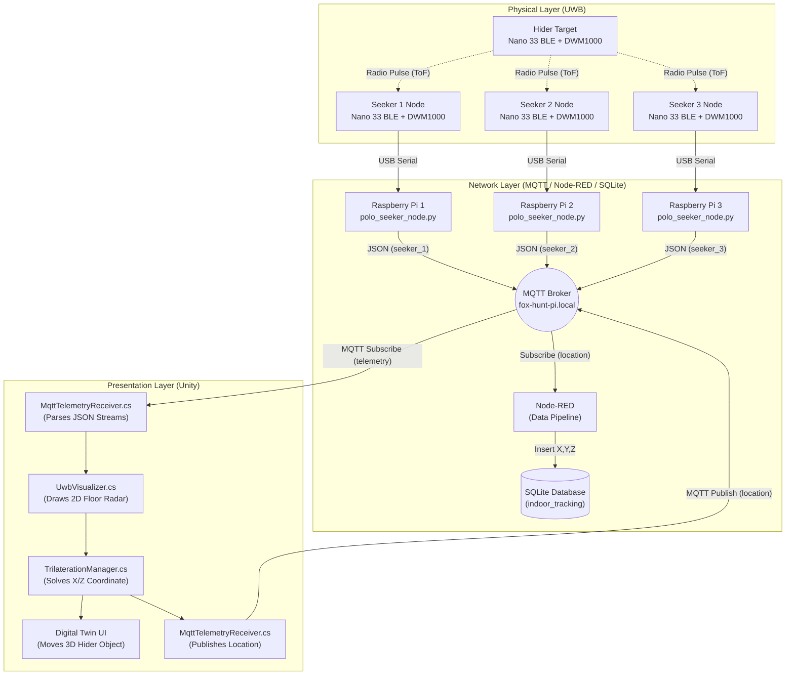

# Marco Polo: Precision Indoor Asset Tracking

**Marco Polo** is a precision indoor tracking and localization system serving as an educational Industry 4.0 application. Designed to bridge the gap between physical sensor hardware and high-level 3D visualization, it utilizes a distributed **Ultra-Wideband (UWB)** multi-node network to achieve centimeter-level accuracy for indoor positioning, mapped directly to a **Unity Digital Twin** via real-time 3D Trilateration.

## 🏗️ System Architecture

The system uses a decoupled, three-layer approach to guarantee real-time performance while maintaining a flexible, high-level application environment:



- **Sensor Coprocessor (Arduino Nano 33 BLE):** Dedicated entirely to real-time UWB radio operations via SPI. This ensures that the highly accurate timing requirements of Two-Way Ranging (TWR) are met without interruptions from a full operating system. It calculates the physical distance mathematically using carrier integrator clock offset correction to prevent temporal drift.
- **Data Router (Raspberry Pi 4):** Handles the high-level Python application logic. A local listener parses the serial telemetry from the Arduino, applies median and moving-average filtering, and publishes the clean JSON data to a central MQTT broker over the local network.
- **Visualization Engine (Unity):** The Digital Twin runs on a host PC. It subscribes to the MQTT broker over the local network, draws the radar rings, and runs a Gradient Descent Non-Linear Least Squares algorithm to perfectly intersect the 3 node distances and track the Hider in true 3D space.

---

## Hardware Requirements

### Per Node (3 Seekers, 1 Hider)

- 1x Arduino Nano 33 BLE Sense
- 1x UWB DWM1000 Sensor
- USB cable (Type-A to Micro-USB for Nano)

### Base Stations

- 3x Raspberry Pi 4 (with power supply and SD card) connected to the same local WiFi network.

---

## Getting Started

### 1. Arduino Wiring & Firmware

The UWB sensor connects directly to the Arduino Nano 33 BLE via SPI:

- **CS**: D10
- **IRQ**: D2
- **RST**: D3
- **MOSI/MISO/SCK**: Standard Nano SPI pins (D11, D12, D13)

Flash the `arduino/v4/marco_hider_lite/marco_hider_lite.ino` sketch to the Hider node.
Flash the `arduino/v4/polo_seeker_lite/polo_seeker_lite.ino` sketch to the 3 Seeker nodes.

### 2. Raspberry Pi Initialization
Log into the 3 Raspberry Pi base stations via SSH on your local network. Ensure the Python environment has the necessary serial and MQTT packages installed on each:
```bash
cd ~/Documents/Marco-Polo/backend
sudo apt update
sudo apt install python3-pip python3-venv
python3 -m venv .venv
source .venv/bin/activate
pip install -r requirements.txt
```

### 3. Launching the System
Plug each Seeker Arduino into its respective Pi's USB port. Run the hardware listener script on each Pi to begin pulling data from the Arduinos and pushing it to the central MQTT broker (`fox-hunt-pi.local`):

**On Pi 1 (The Main Broker):**
```bash
cd ~/Documents/Marco-Polo/backend
python3 polo_seeker_node.py --id seeker_1
```

**On Pi 2:**
```bash
cd ~/Documents/Marco-Polo/backend
python3 polo_seeker_node.py --id seeker_2 --broker fox-hunt-pi.local
```

**On Pi 3:**
```bash
cd ~/Documents/Marco-Polo/backend
python3 polo_seeker_node.py --id seeker_3 --broker fox-hunt-pi.local
```

### 4. Unity Digital Twin
Open the Unity project, ensure your `MQTT_Manager` is pointing to `fox-hunt-pi.local` (or the specific IP address of Pi 1), and hit **Play**. Move the physical Hider tag around the room to watch the digital twin track it in real-time!

---

## Repository Structure

- `arduino/`: Firmware source code for the Arduino Nano 33 BLE (`marco_hider`, `polo_seeker`).
- `backend/`: The Python MQTT gateway (`polo_seeker_node.py`) and Node-RED database files.
- `docs/`: Project documentation, including the [Lessons Learned & Roadmap](file:///c:/Users/lukep/Documents/Marco-Polo/docs/lessons_learned.md).
- `UWB_Telemetry_Engine/`: The complete Unity 3D Digital Twin project.
- `system-verify/`: Tools for validating hardware connections.

---

*Developed as a prototype for precision indoor asset tracking, integrating multi-node UWB trilateration into modern 3D engines.*
